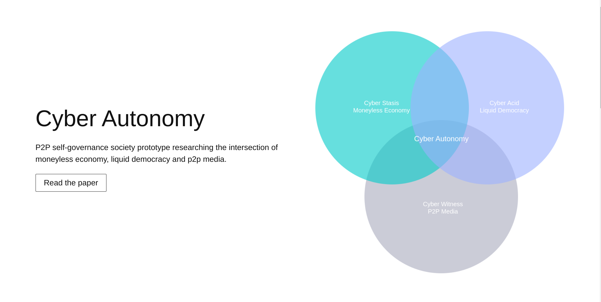
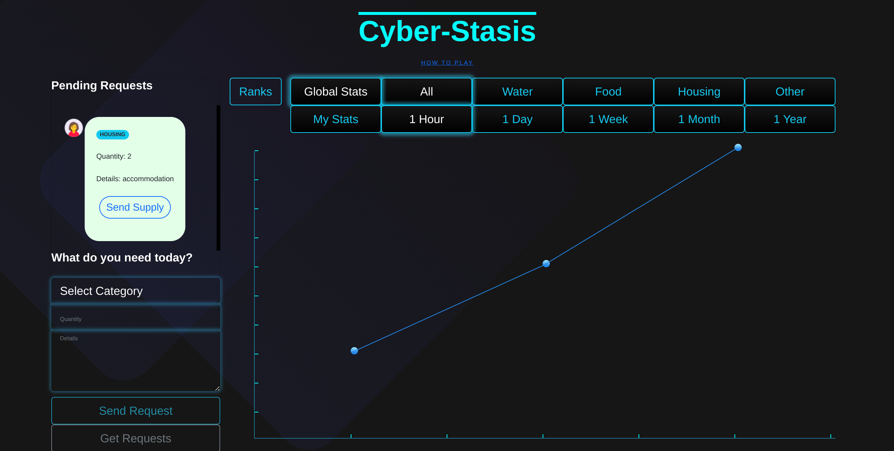
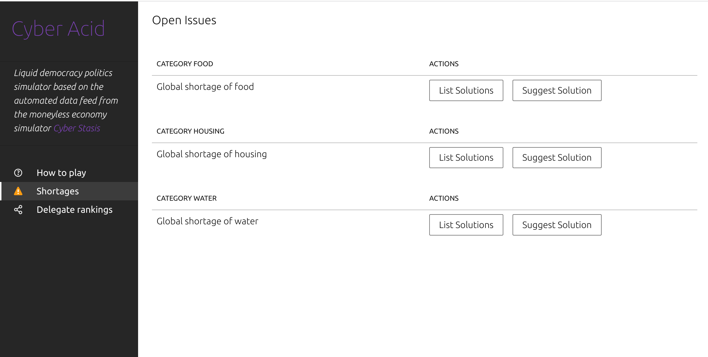
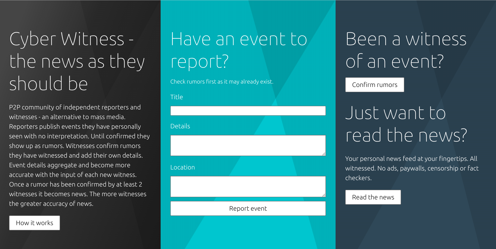
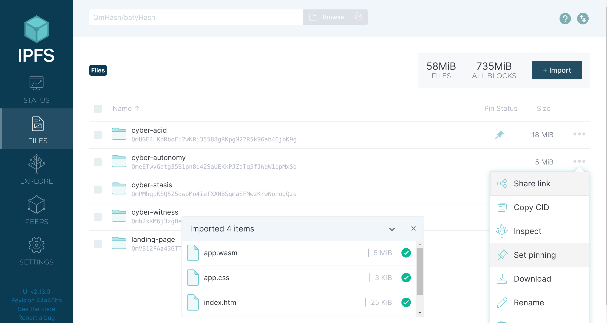
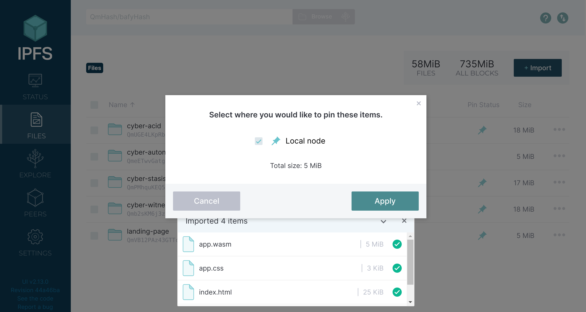

  

  

# Cyber Autonomy

  

  

  



  


We are increasingly living in a centralized, totalitarian society where we end up atomized instead of empowered autonomous individuals. What's more the intellectual elite which has always produced alternative ideas is fruitless to define a new path ahead and unusually silent. The world-known philosophers of the 19th and 20th centuries are a distant memory with nothing truly new at the horizon that reflects technological progress and overall human development.

Cyber Autonomy is the fruit of a year of applied research and a couple of years of conceptualization. It summarizes the abstracts of autonomy across the pillars of our society -  economics, politics and media and offers viable alternatives to the status quo. At its core it focuses on the autonomy of the individual as a stepping stone for a vital global community. The goal is to bring back autonomy to the forefront of discussions and to attract the attention of the academic circles.

  

  

## Screenshots

  

  

  

<a  display="inline"  href="./web/cyber-stasis.png?raw=true">

  

  



  

  

</a>

  

  

  

<a  display="inline"  href="./web/cyber-acid.png?raw=true">

  

  



  

  

</a>

  

  

  

<a  display="inline"  href="./web/cyber-witness.png?raw=true">

  

  



  

  

</a>


  

## Community

  

  

https://www.reddit.com/r/CyberAutonomy/

  

  

## How to Install

  

  

  

The website runs on the public IPFS network. In order to view it follow the steps below:

  

  

  

1. Install the official IPFS Desktop http://docs.ipfs.io/install/ipfs-desktop/

  

  

2. Install IPFS Companion http://docs.ipfs.io/install/ipfs-companion/

  

  

3. Clone https://github.com/stateless-minds/kubo to your local machine, build it with `make build` and run it with the following command: `~/cmd/ipfs/ipfs daemon --enable-pubsub-experiment`

  
4. Follow the instructions here to open your config file: https://github.com/ipfs/kubo/blob/master/docs/config.md. Usually it's `~/.ipfs/config` on Linux. Add the following snippet to the `HTTPHeaders`:

  

```{

  

"API": {

  

"HTTPHeaders": {

  

"Access-Control-Allow-Origin": ["webui://-", "http://localhost:3000", "http://k51qzi5uqu5djrwn8frgucxd2g11vmyw2hygv8z7dz7kjtrvzza73b6b87zs0c.ipns.localhost:8080", "http://127.0.0.1:5001", "https://webui.ipfs.io"],

  

"Access-Control-Allow-Credentials": ["true"],

  

"Access-Control-Allow-Methods": ["PUT", "POST"]

  

}

  

},

  

```

5. Navigate to <a  href="https://ipfs.io/ipns/k51qzi5uqu5djrwn8frgucxd2g11vmyw2hygv8z7dz7kjtrvzza73b6b87zs0c">Cyber Autonomy</a> and let's simulate the future together!
  

6. If you like the idea consider pinning it to your local node so that you become a permanent host of it while you have IPFS daemon running

  

  



  

  



  

  

  

Please note the website has been developed on a WQHD resolution(2560x1440) and is currently not responsive or optimized for mobile devices. For best experience if you view in FHD(1920x1080) please set your browser zoom settings to 150%.

## Acknowledgments

  

  

  

1.  <a  href="https://go-app.dev/">go-app</a>

  

  

2.  <a  href="https://ipfs.io/">IPFS</a>

  

  

3.  <a  href="https://berty.tech/">Berty</a>

  

  

4. All the rest of the authors who worked on the dependencies used! Thanks a lot!

  

  

  

## Contributing

  

  

  

<a  href="https://github.com/stateless-minds/cyber-autonomy/issues">Open an issue</a>

  

  

  

## License

  

  

  

Stateless Minds (c) 2022 and contributors

  

  

  

MIT License
